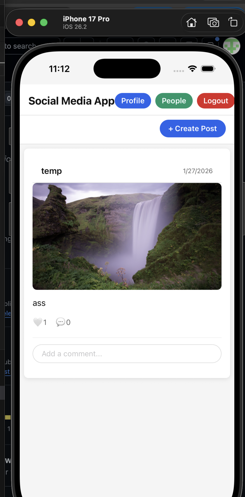
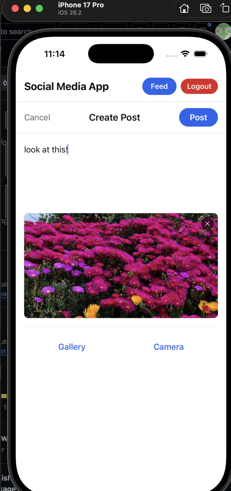
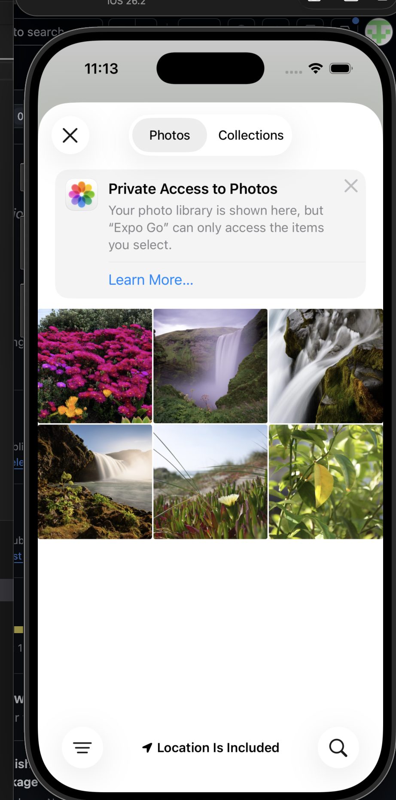
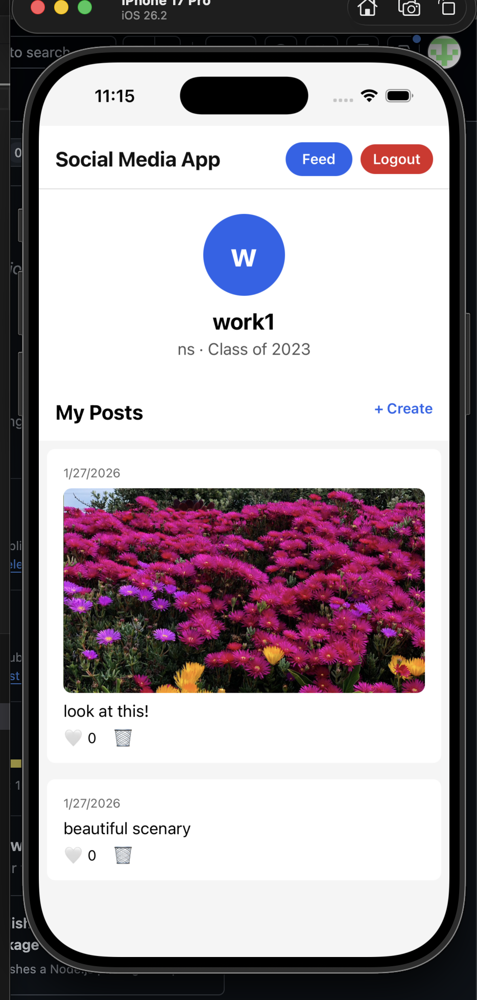
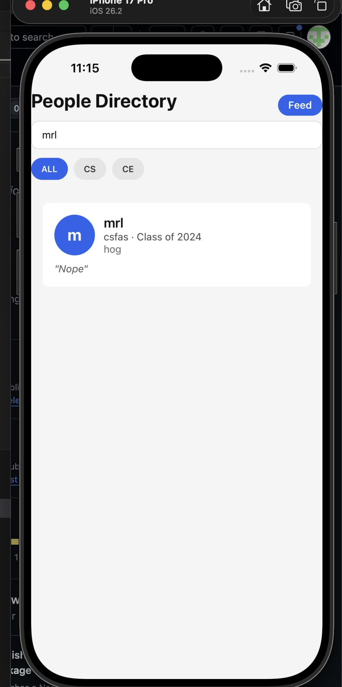

# Social Media App

A full-stack, cross-platform social media application built with **React
Native (Expo)** on the frontend and **Node.js + Express** + **MongoDB** on the
backend. The app allows users to create posts with images, view a feed,
interact with content (post text/images or see other posts), Search up users, and manage their profile, all within a
mobile-first experience designed to feel modern, responsive, and
intuitive.

------------------------------------------------------------------------

## Project Description

The Social Media App replicates core functionality found in modern
social platforms, including image-based posting, a social feed, and
profile management. The project focuses on understanding full-stack
integration, API design, state management, and mobile UI/UX best
practices.

On the backend, I used passport for authentication, express and RESTful style API. I also used MongoDB for storage
On the frontend, I used react native, Zustand for global store and Expo for using the app. 
The entire code was written in Javascript

------------------------------------------------------------------------

## Deployed Application

This project is intended for local development and demonstration. A
public production deployment is not currently live.

------------------------------------------------------------------------

## Tech Stack

### Frontend

-   React Native
-   Expo
-   JavaScript
-   Zustand
-   React Navigation

### Backend

-   Node.js
-   Express
-   MongoDB (Mongoose)
-   passport for authentication

------------------------------------------------------------------------

## Setup Instructions

### MUST BE TESTED ON EXPO GO via a IOS Simulator!

### Prerequisites

-   Node.js (v18+)
-   npm
-   IOS emulator

### Backend Setup

``` bash
cd Social-Media-App-API 
npm install
npm start
```

### Frontend Setup

``` bash
cd Social-Media-App-Frontend
npm install
npm start
press i to open IOS simulator to test code
```

# IMPORTANT NOTE: 
**code was tested with an online version of MongoDB and then because i did not want to share my API key, I changed it to be local**
**This means that please run code (both frontend and backend) along with the IOS simulator on the same laptop**

------------------------------------------------------------------------

## API Backend overview

The backend exposes a RESTful API organized by feature area. All protected routes require authentication via Passport.

### Authentication (`/auth`)

* `POST /auth/signup`
  Create a new user account and return an authentication token.

* `POST /auth/signin`
  Authenticate an existing user and return a JWT token.

---

### User Profiles (`/profile`)

* `POST /profile/new`
  Create or update the authenticated user’s profile.

* `GET /profile/me`
  Fetch the profile of the currently authenticated user.

* `GET /profile/search`
  Search for user profiles by query (used for the “Search People” feature).

* `PATCH /profile/visibility`
  Update profile visibility settings.

* `GET /profile/:userId`
  Fetch a specific user’s profile by user ID.

---

### Posts & Feed (`/posts`)

* `POST /posts`
  Create a new post (text and optional image).

* `GET /posts`
  Retrieve the main feed (posts from all users).

* `POST /posts/:postId/like`
  Like or unlike a post.

* `POST /posts/:postId/comment`
  Add a comment to a post.

* `DELETE /posts/:postId`
  Delete a post owned by the authenticated user.

---

### User-Specific Posts (`/user-posts`)

* `GET /user-posts/user/:userId`
  Retrieve all posts created by a specific user (used for profile views).

---

### Images (`/images`)

* `POST /images`
  Upload an image and store its metadata in the database.

* `GET /images/:id`
  Retrieve an image by ID.

* `DELETE /images/:id`
  Delete an image from storage and the database.

------------------------------------------------------------------------

## Frontend Architecture Overview

The frontend is a mobile-first React Native application built with Expo. It uses a screen-based navigation model, centralized global state via Zustand, and a service layer to communicate with the backend REST API.

### Navigation Structure

The app uses **React Navigation** to manage screen transitions. Core screens include:

* **Signin**
  User authentication screen for existing users.

* **Signup**
  Account creation screen. On successful signup, users are redirected to profile completion.

* **CompleteProfile**
  Collects additional user information (name, class year, major, quote) immediately after signup.

* **Feed**
  The main social feed displaying posts from all users. Supports liking, commenting, deleting posts, and pull-to-refresh.

* **CreatePost**
  Allows users to create a new post with text and an optional image, using the device gallery or camera via Expo Image Picker.

* **Profile**
  Displays the authenticated user’s profile information and their posts.

* **ProfileDirectory**
  Searchable directory of user profiles with filtering by major and infinite scrolling.

Navigation is conditionally controlled based on authentication state.

---

### Global State Management

Global state is managed using **Zustand**, which simplifies state updates and avoids boilerplate associated with heavier state managers.

Key global state slices include:

* Authentication state (user, token, login status)
* Signup flow state (e.g., forcing profile completion)
* Logout handling and token clearing

This enables consistent access to user information across screens without prop drilling.

---

### API Communication Layer

All network requests are handled through a centralized API service module. This layer:

* Attaches authentication tokens to requests
* Encapsulates REST API calls for posts, profiles, images, and authentication
* Keeps UI components focused on rendering and interaction logic

---

### Core UI Components

Reusable components are used to keep the UI consistent and modular:

* **ProfileHeader**
  Shared header with navigation shortcuts (Feed, Profile, People Directory) and logout functionality.

* **ProfileCard**
  Displays summarized profile information in the People Directory.

These components help enforce consistent styling and reduce duplication.

---

### Media Handling

* Image selection and capture are implemented using **Expo Image Picker**
* Images are uploaded using `multipart/form-data`
* Posts can include text, images, or both
* Platform-specific URI handling is normalized before upload

---

### User Experience Considerations

* Pull-to-refresh on feeds and profiles
* Optimistic UI updates for likes
* Input validation and user-friendly error messages
* Keyboard-aware layouts and safe area handling

------------------------------------------------------------------------

## Screenshots

### Sign In


### Feed


### Feed With My Posts


### Create Post


### Photo Picker



### My Profile



### Search People



------------------------------------------------------------------------

## Learning Journey

### Inspiration

This project was inspired by a desire to understand how real-world
social media applications ARE built. 

### Potential Impact

The app serves as both a learning reference and a foundation for
building scalable, mobile-first social platforms. Who knows with a 
better styling and a few more weeks of work, maybe this is the next 
dartmouth social media app :)

### New Technologies Learned

The really only new thing that i had little experience with was passport and setting up authentication. 
(QUITE THE JOURNEY LOL). I choose it because while doing CS52, the professor had a extra credit assignment 
using passport aunthentication for apps. I didn't do it then. Fortunately the application gave me the opportunity 
to learn this new thing. 

------------------------------------------------------------------------

## Technical Rationale

### Architecture

The frontend and backend are separated to enforce clean API boundaries.
REST APIs keep the system modular and scalable.

### Tradeoffs

-   REST over GraphQL for simplicity
-   Local image handling instead of cloud storage (though as I noted above I did have cloud storage working!)

### Most Difficult Bug

Image URI handling in React Native caused upload failures. This was
debugged by inspecting platform-specific URI formats and normalizing
data before sending it to the backend.

------------------------------------------------------------------------

## AI Usage

### Tools Used

ChatGPT was used for debugging and UI styling assistance. Thety also suggested lines as auto complete was on. 

### Example

**Prompt:**\
"Improve the styling of a React Native post creation screen with better
spacing and visual hierarchy. Keep the same that I already have (pasted my style sheet)"

**Output:**\
"STYLE SHEET STYLING CODE!"

**Adaptation:**\
The suggested styles were refactored to remove web-only assumptions,
adjusted for mobile responsiveness, and aligned with the app's existing
design system.

------------------------------------------------------------------------

## Future Improvements

- I wanted to get to work better. I wanted to add stuff from the DALI like whats your favourite major and your favourite quotes
- MESSAGING WAS A BIG THING FOR ME TO IMPLEMENT IF I HAD THE TIMEEEEE :(((((((((

------------------------------------------------------------------------

## Author

**Ahmad Wahab**\
Dartmouth College, Class of 2027\
Computer Science
